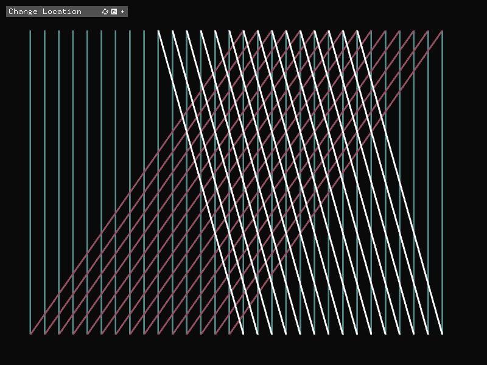

# Moving lines
I kept coming blank when I was trying to find an idea for this project. So this is just a simple combination of lines where I test out the technical side of openFrameWorks and get comfortable programming with it.

## Summary
I started by creating 50 verticle lines with and 25 of them diagonal then i created another 25 mirroring the first 25 and gave the user controle over the angle. 
something like that:

Then I decided to give the user some control over each of the sets seperatley because I wasn't the biggest fan of all the angles and thought if I give the user control the user can decide the end result they want.
I also gave the user control over the color.

I also decided to give more control over the color and the number of lines. So if the user decides to change the colors between the line sets and the number of lines they can. I added a toggle to change between the lines having different colors and all the lines have one color.
I used 3d vectors for colors, but I think it would be smart to use a color gui variable instead. \

## Screen Shots
Here are some more screen shots of the sketch:

## Video
[Video Link](https://youtu.be/COAPV2zMQRs "Sketch 1")
