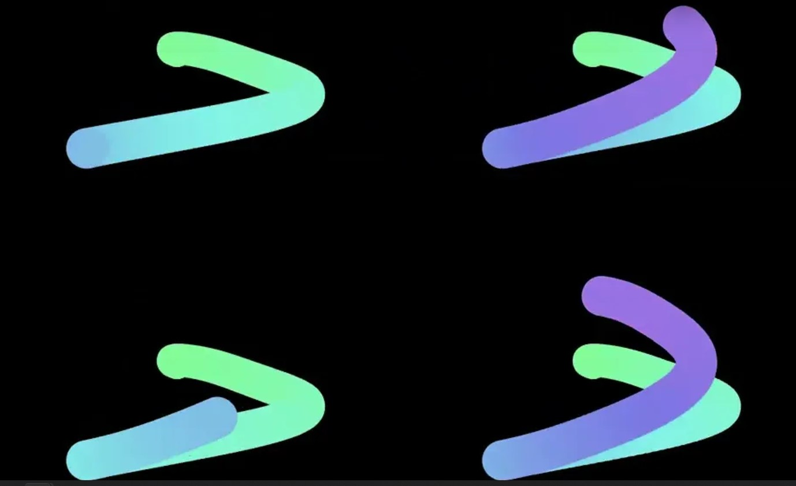

# Documentation
## Inspiration
I was inspired by the sign wave we saw in class for this sketch, I found it really interesting and facinating so I wanted to play around with it. by changing some stuff and adding to it i created something new!
## Describtion
For this sketch, I used the same circles he used to draw the animation. I, however, replaced some of the sign functions he used by noise functions for the motion of the line. instead of having the noise only on the x valueor the y value, i put it on both but with different rates of change so that the motion is not just back and forth from a point. 
I kept the size controle with the sin functions because I prefered the transition of the sizes than the random one the noise function offered.
I used noise to control the color as well. I used HSB color palette so changeing the color was easy using the Hue value of Hsb colors. I also allowed the user to control the color saturation using gui, because I like pastel colors but not everyone is the same, so i wanted the user to have control. 
I also wanted to add my own creativity to it, so I allowed the user to choose a number from 1-11. The code calculates the first square number below said number and draws the "animation" the chosen square number of times.

## Images
one (initial saturation)    |     four (low saturation)  |    nine (high saturation)
:-------------------------:|:-------------------------:|:-------------------------:
  |  |  

## Video

## To work on
- One thing I would like to work on is the noise/sin finction coordination. Because the noise function did not match the circle size created by the sin function, the sketch often shows the circles in the random line which I did not love.
- other thing I would like to work on is to make the code adaptable to any square number not just 4 and 9 as when i tried an inner loop to make the 9 different drawings for example, the animation was not as smooth as I would like. Maybe I had a different error somewhere, but I would generaly like to work on that.
