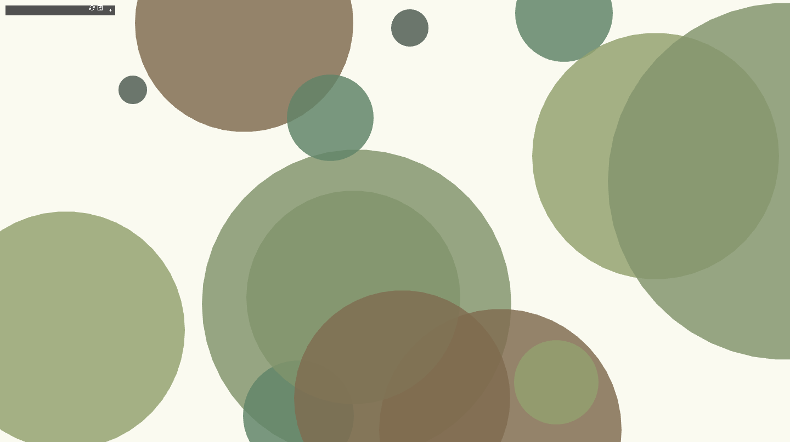
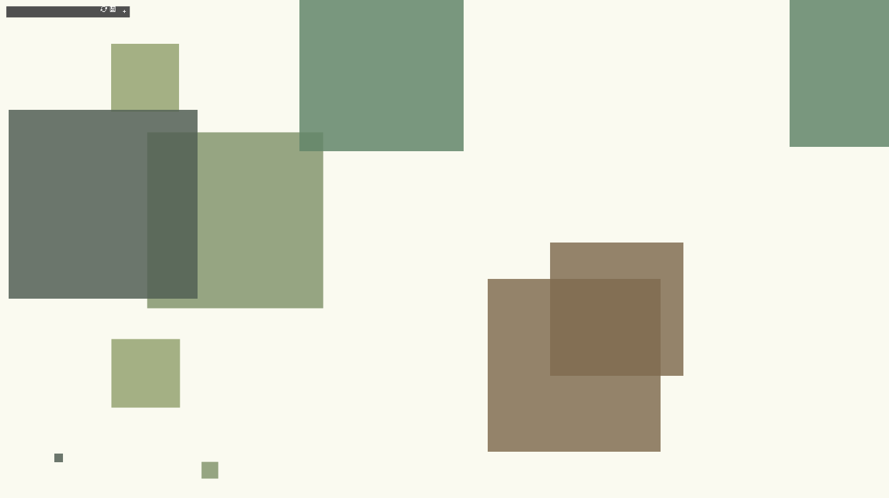
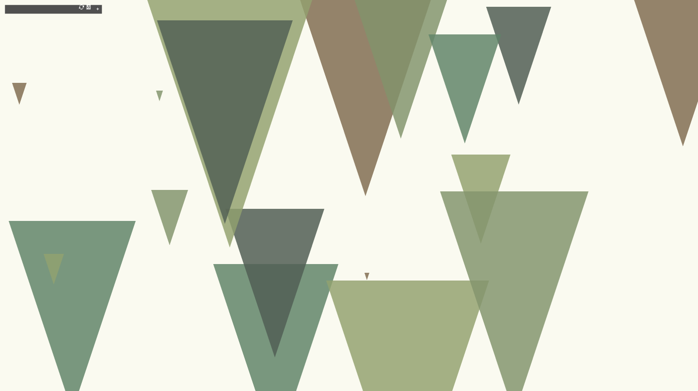
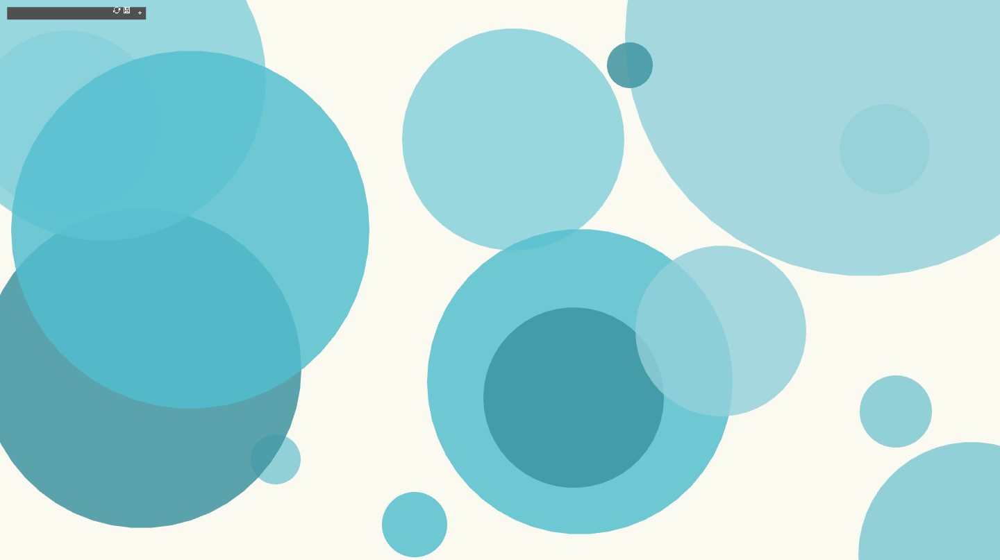

# Assignment 1: STILL

## Description
For this assignment, we made a series of thematic images consisting of shapes that can be controlled by sliders. The users can control the shapes by pressing on the space bar, alternating between circles, squares, and triangles. They can also decide on the theme using the sliders, all of which are meant to be consonant. The themes are: forest, ocean, and desert.

## Algorithm
The first thing we did was, in the header file, initialize the gui as well as the parameter groups and specific parameters that we want to have displayed. We then initialized arrays for the themes and *shapes* for the shapes. Next, in the app file, we added the categories to their groups based on what they control, whether it's the theme or the shapes, assigning the starting values as well as the ranges for each of the controlled categories.

Next, we added 5 colors in each theme array that were purposely chosen from [Palette Generator](https://coolors.co/generate) to go with the selected themes. *shapes*. Then we changed the color opacity to 200 to show the different layers and give the image a percentage of depth in a 2D design.

The rest of the code was in the draw function so that it's constantly ongoing. We set the background to a light color that's close to white as we wanted the colors on top to stand out, we set the initial color to white and the *shapes* based on the starting points in the setup function. We gave the user the option to change the number of shapes on the screen and we changed the starting point for each change of n shapes.

The shapes we chose were *triangle*, *circle* or *Square*, where the user was allowed
To switch between them by clicking `'space'`.

Then we created a for loop to assign the colors based on the chosen theme and ensure that the 5 colors of each theme are repeated so that no one color is shown more than the others. The segment of code that controls this is as follows, with an example of the forest theme:

```
int j = 0;
int count = 0;
    
for (int i = 0; i < nShapes; i++){
    	if (count % 5 == 0) {
        	j = i;
    	}   	 
    	ofSetColor(forest_array[i-j].x, forest_array[i-j].y, forest_array[i-j].z); //example for forest theme
    	**** code for the rest of the themes and to draw shapes ****
    	count ++;
}
```

This was made to restart the starting color from the array after 5 shapes are drawn. *shapes*. This was finally followed by the `gui.draw()` function and we added a few lines to take screenshots when the `'s'` *key* is pressed and ran the code.

## Sample Output
<!-- https://github.com/fnassar/SoftwareArt/blob/main/assignment1/mySketch/bin/data/screenshot0.png -->
### The Forest Theme
Circles                    |          Squares          |  Triangles
:-------------------------:|:-------------------------:|:-------------------------:
  |  |  

### The Ocean Theme


### The Desert Theme


## Evaluation
We are both overall satisfied with our output. The end result is something we both really liked specially because the theme of shapes and colors were both really relaxing to look at.
The colors are all from natural images that a person looks at to relax. The one thing that we think stands out is the desert colors, as normally yellow is a color that does the opposite of relaxation but in this color mix from nature, it is really nice to look at.
Neither of us had focused on colors in the previous sketch so we tried to spend a lot of time understanding and working with colors this time to make it look as we wanted.

One thing that we struggled with was making the color options toggle between themes easily like a select option. After painful long tries, we decided to keep out the first try where it was not always perfect but it worked. The problem is when pressing on the first toggle and then the second, it easily switches between the two, however pressing back on first after second did not work until the second one is unpressed. This avoids pressing 2 at the same time so we kept it even though it was not the best choice.

