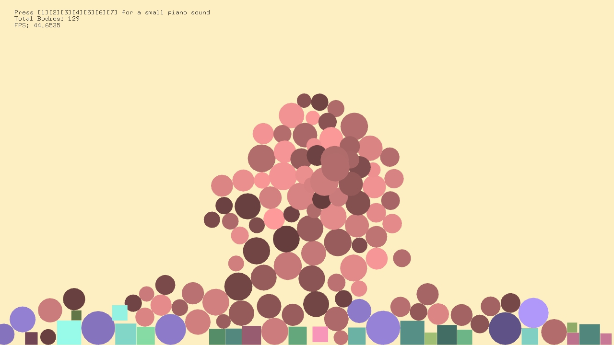
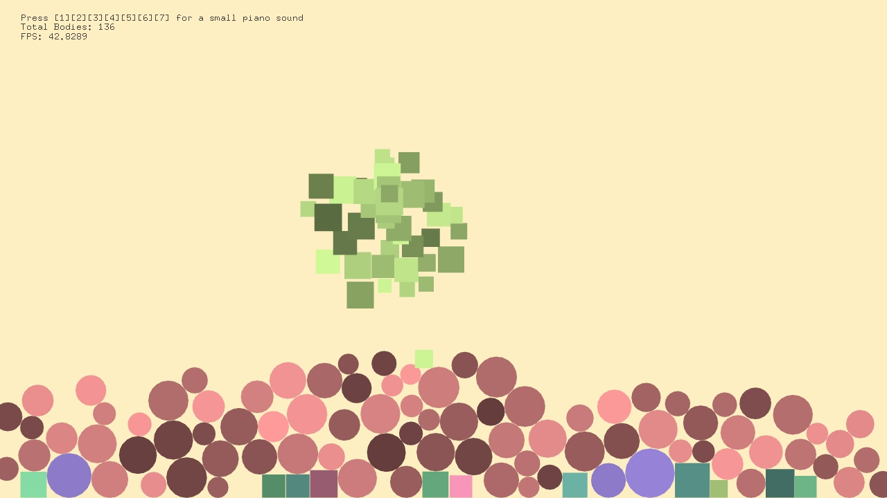
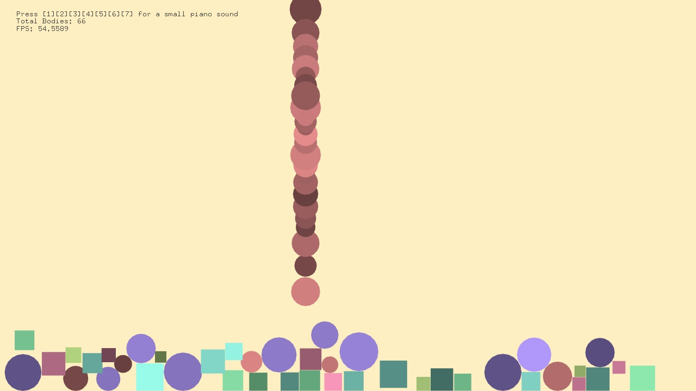

# Assignment 1: Animation

## Description
For this assignment, I used ofBox2d library to create an interactive animation where the user can press on keyboard keys 1-7 to play a simple tune using the do, re, me, fa, so, la, si sounds. As the user plays the sound, shapes of different colors apear on the screen and fall to the bottom on the screen.

## Algorithm
- The first thing I did was create 2dBox classes where i assign a sound, color and dimentions to the shape. 
- I created 2 classes, one for squares and one for circles.
- I assigned an integer i for each key press which determines the size and color range the shape is created with.
- The shapes are created at mouse location
- I was going to create boundries on the sides but I felt like it would be better to not fill the screen with all the shapes, and let them disapear on the side.
- I added instructions on top of the screen, I did not add much details to it.
- I play the sound when shapes are first generated.
### Color and Shape
- for the colors, I used Hsb to choose the base color for each key, but created a random integer for the colors to have different shapes and for the apearance of the objects to have more dimention.
- I also created each key press with a random size within a range of sizes.

### Code Snipits
Whenever a key is pressed I created a new class object and added it to a vector.
> Vectors are generally easier to use when you need to delete and add objects, so as I was deleting the boxes as they leave the screen, vectors were a lot easier to use
```
  float x = ofRandom(15, 30);
	 ofColor col1 = RGB(150, 0, 150);
		auto particle = make_shared<Circle2d>(box2d.getWorld(), mouseX, mouseY, x, 0, audioFiles[0]);
		circle2d.push_back(particle);
		particle->playSound();
```

I added a few lines to take screenshots when the `'s'` *key* is pressed.

## Sample Output

### Sample Screenshots
1                          |              2            |           3
:-------------------------:|:-------------------------:|:-------------------------:
  |  |  

### Video


## Evaluation
I am generally really happy with my result. I had hoped to do more, but figuiring out box2d classes was more complicated than I thought it would be.
I also tried adding poly boxes instead of just circles and squares but I could not make it work.

